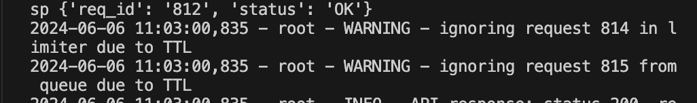
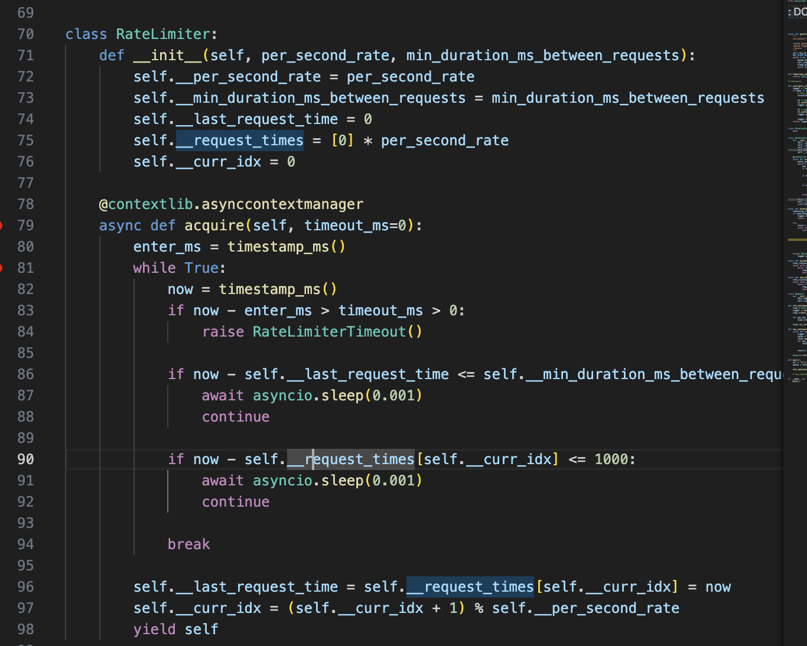
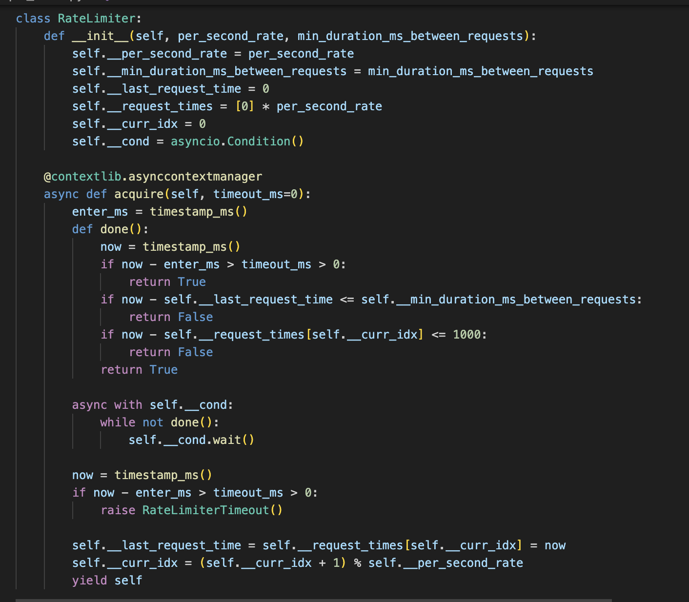
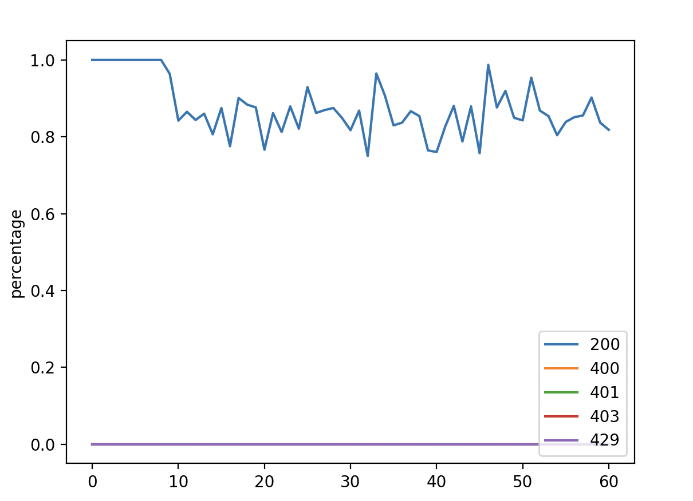
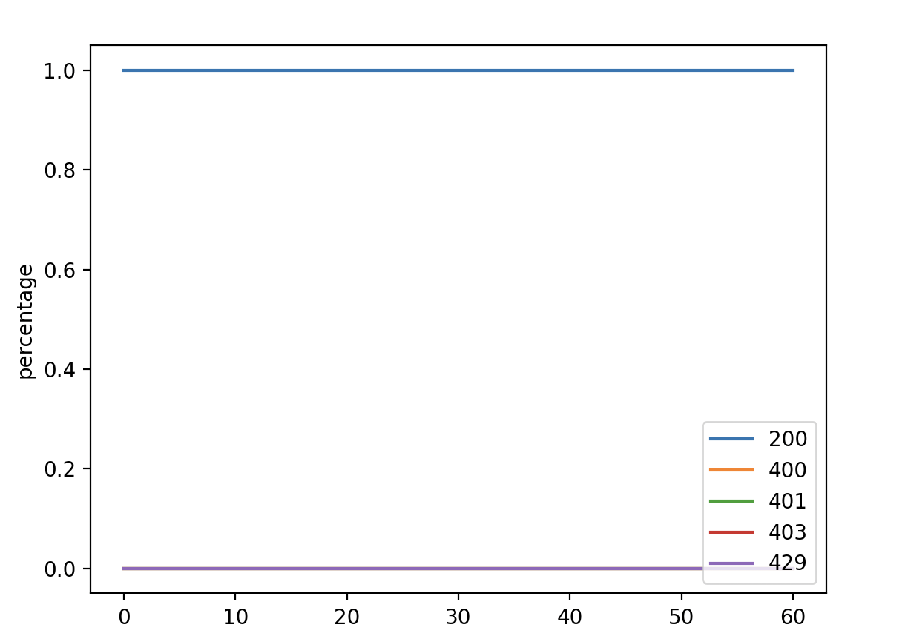

# Client Improvements 

## 1. Background 

First of all, we need to see what's the current behavior of client and server 

### 1.1. Server
- Each api key has a rate limiter of 20 QPS
- If the request is successfully be handled and return with status code = 200, the total latency will be between [0, 0.1] seconds

### 1.2. Old Client 
- There is a function to generate requests and put into a queue. The interval of new request generated is between [0, 0.02] seconds. On average, the number of requests put into the queue will be 100 per second. 

- For api_key, there is a worker responsible for sending the request to the server. The rate limit is implemented for each api_key. 

- The current behavior is that for each worker, the request is processing in synchronous manner which reduces the throughput of the client. This is neccessary for ensuring the server will process new request from the same api with increasing value of nonce. 

- As running the benchmark, some requests are being dropped due to TTL from the queue as well as from the rate limiter.  

- Will increase the throughput if we could reduce the chance the request TTL from the queue and limiter. 

From this limiter code, we can see there is a sleep of 0.001 seconds. This is the culprit for the request being dropped due to TTL. We could use conditional variable  for avoiding such unneccesary sleep

## 2. Benchmarking 

The author is written a small Python program in qps_analyzer.py for visualizing the success rate of request by reading the async-debug.log file. Will use this utility program to compare between old and new client implementation change. 

### 2.1. For current client implementation 

The average success rate client send and process from server is around 80%. The other 20% is due to TTL either in rate limiter or in queue.  

### 2.2. Aft the improvement 

By using the asyncio.Condition variable for RateLimiter to efficiently wait for the condition, we could efficiently maximize send all requests from the queue to the server

